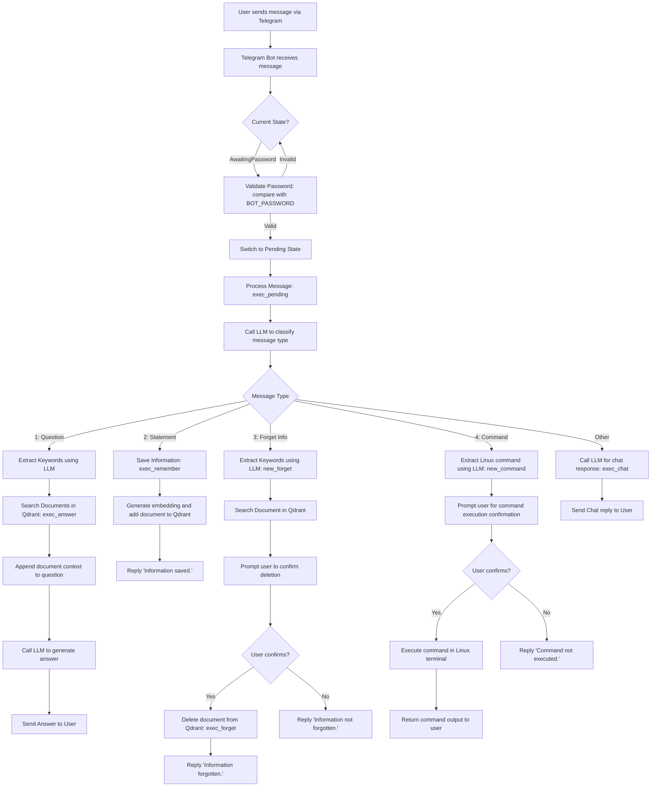

# 🤖 AI Agent Telegram Bot

A smart and friendly AI-powered Telegram bot that can answer questions, store and forget information, and even execute terminal commands on request. Built with Rust, powered by LLMs and vector search via Qdrant.

## 🧠 Features

- 🔐 Password-protected access
- 💬 Classifies user input (question, info, forget request, command, etc.)
- 📚 Stores and searches documents with vector embeddings (Qdrant)
- 🤖 Talks to an LLM for reasoning, classification, and responses
- 💥 Can execute Linux commands after confirmation
- 🔁 State-based interaction flow (e.g., confirmation dialogs)
- 🐳 Docker & Docker Compose support

## 🛠 Tech Stack

- Rust + Tokio async runtime
- [`teloxide`](https://github.com/teloxide/teloxide) — Telegram bot framework
- [`reqwest`](https://github.com/seanmonstar/reqwest) — HTTP client
- [`serde`](https://github.com/serde-rs/serde) — JSON serialization
- [`qdrant`](https://qdrant.tech/) — Vector search engine
- Any LLM that supports OpenAI-compatible API (e.g. [`lm-studio`](https://github.com/lmstudio-ai/lms), [`ollama`](https://github.com/ollama/ollama), etc.)

## 🚀 Quickstart (Docker Compose)

```bash
# Copy .env-example and configure your keys
cp .env-example .env

# Build and run
docker compose up --build
```

> Make sure your LLM server is running and accessible at the given URLs in `.env`.

## 📦 Environment Variables (`.env`)

```env
TELOXIDE_TOKEN=your_telegram_bot_token
OPENAI_API_KEY=dummy_or_real_key
CHAT_COMPLETIONS_URL=http://localhost:1234/v1/chat/completions
CHAT_COMPLETIONS_MODEL=gemma-3-12b-it
EMBEDDINGS_URL=http://127.0.0.1:1234/v1/embeddings
EMBEDDINGS_MODEL=lm-kit/text-embedding-bge-m3
EMBEDDINGS_LENGTH=1024
QDRANT_URL=http://localhost:6333
QDRANT_COLLECTION_NAME=documents
BOT_PASSWORD=supersecret
```

## 🧑‍💻 Local Development

```bash
# Install Rust
curl --proto '=https' --tlsv1.2 -sSf https://sh.rustup.rs | sh

# Run the bot
cargo run
```

Make sure Qdrant and your LLM API are running and accessible. You can use Docker for Qdrant:

```bash
docker run -p 6333:6333 qdrant/qdrant
```

And run LM Studio or similar on port 1234.

## 🤓 How it Works (Black Box)

1. Bot asks for a password
2. After login, it classifies each message using the LLM:
    - Question → Uses vector search + LLM to answer
    - Informational text → Stores it in Qdrant
    - Forget request → Confirms and deletes from Qdrant
    - Terminal command → Confirms before running it
3. Uses embeddings to find semantically similar data
4. Everything happens with friendly and minimal responses

## 📝 How it Works (White Box)


## 📁 Project Structure

```
├── src/
│   ├── main.rs        # Telegram bot logic & state machine
│   ├── ai.rs          # LLM + embedding logic
│   └── qdrant.rs      # Qdrant vector DB integration
├── .env-example       # Config template
├── Dockerfile
├── docker-compose.yml
└── README.md
```

## 🧡 Credits

- Inspired by real assistant workflows
- Powered by open tools: Rust, Qdrant, and community LLMs

---

> Built with ❤️ and `cargo build --release`


