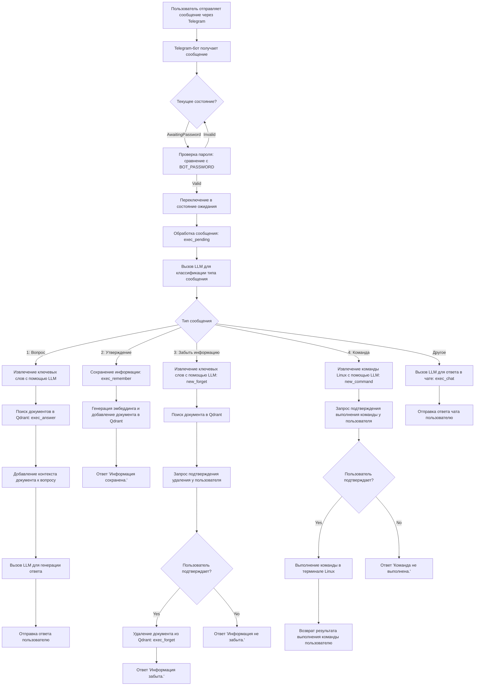

[`English version`](https://github.com/evgenyigumnov/ai-agent-telegram-bot)
# 🤖 Телеграм-бот AI-агента

Умный и дружелюбный Telegram-бот с поддержкой ИИ, который может отвечать на вопросы, сохранять и забывать информацию, а также выполнять команды терминала по запросу. Построен на Rust, использует LLM и векторный поиск через Qdrant.

## 🧠 Особенности

- 🔐 Доступ с защитой паролем
- 💬 Классифицирует ввод пользователя (вопрос, информация, запрос на забывание, команда и т.д.)
- 📚 Сохраняет и ищет документы с использованием векторных эмбеддингов (Qdrant)
- 🤖 Общается с LLM для рассуждений, классификации и ответов
- 💥 Может выполнять команды Linux после подтверждения
- 🔁 Взаимодействие на основе состояний (например, диалоги с подтверждением)
- 🐳 Поддержка Docker и Docker Compose

## 🛠 Технологический стек

- Rust + асинхронный runtime Tokio
- [`teloxide`](https://github.com/teloxide/teloxide) — фреймворк для Telegram-ботов
- [`reqwest`](https://github.com/seanmonstar/reqwest) — HTTP клиент
- [`serde`](https://github.com/serde-rs/serde) — сериализация JSON
- [`qdrant`](https://qdrant.tech/) — векторный поисковый движок
- Любой LLM, поддерживающий API, совместимый с OpenAI (например, [`lm-studio`](https://github.com/lmstudio-ai/lms), [`ollama`](https://github.com/ollama/ollama) и т.д.)

## 🚀 Быстрый старт (Docker Compose)

```bash
# Скопируйте .env-example и настройте ваши ключи
cp .env-example .env

# Соберите и запустите
docker compose up --build
```

> Убедитесь, что ваш LLM-сервер запущен и доступен по указанным URL в файле `.env`.

## 📦 Переменные окружения (`.env`)

```env
TELOXIDE_TOKEN=your_telegram_bot_token
OPENAI_API_KEY=dummy_or_real_key
CHAT_COMPLETIONS_URL=http://localhost:1234/v1/chat/completions
CHAT_COMPLETIONS_MODEL=gemma-3-12b-it
EMBEDDINGS_URL=http://127.0.0.1:1234/v1/embeddings
EMBEDDINGS_MODEL=lm-kit/text-embedding-bge-m3
EMBEDDINGS_LENGTH=1024
QDRANT_COLLECTION_NAME=documents
BOT_PASSWORD=supersecret
```

## 🧑‍💻 Локальная разработка

Раскомментируйте и настройте следующие переменные окружения в файле `.env`:
```
QDRANT_URL=http://localhost:6333
```

Убедитесь, что Qdrant и ваш LLM API запущены и доступны. Вы можете использовать Docker для Qdrant:

```bash
docker run -p 6333:6333 qdrant/qdrant
```

А также запустите LM Studio или аналогичный сервис на порту 1234.

```bash
# Установите Rust
curl --proto '=https' --tlsv1.2 -sSf https://sh.rustup.rs | sh

# Запустите бота
cargo run
```

## Пример чата с ботом

```
Evgeny Igumnov:
Привет!

Igumnov's memory extention:
Неверный пароль. Попробуйте снова.

Evgeny Igumnov:
supersecret

Igumnov's memory extention:
Пароль принят. Вы можете продолжать работу с ботом.

Evgeny Igumnov:
День рождения у Кати 24 ноября.

Igumnov's memory extention:
Информация сохранена.

Evgeny Igumnov:
Какой у меня пароль от wifi?

Igumnov's memory extention:
Ваш пароль от Wi-Fi: 4040404040. 

Evgeny Igumnov:
Запусти команду отображающую список файлов в папке текущей

Igumnov's memory extention:
Запустить команду "ls" ?

Evgeny Igumnov:
да

Igumnov's memory extention:
Результат работы команды

all-files.sh
Cargo.lock
Cargo.toml
docker-compose.yml
Dockerfile
LICENSE
README.md
src

Evgeny Igumnov:
Когда у Кати день рождения?

Igumnov's memory extention:
У Кати день рождения 24 ноября.

Evgeny Igumnov:
Забудь когда у Кати день рождения

Igumnov's memory extention:
'День рождения у Кати 24 ноября.' Забыть информацию?

Evgeny Igumnov:
да

Igumnov's memory extention:
Информация забыта.
```
## 🤓 Как это работает (Черный ящик)

1. Бот запрашивает пароль.
2. После входа он классифицирует каждое сообщение с помощью LLM:
   - **Вопрос** → Использует векторный поиск + LLM для ответа.
   - **Информационное сообщение** → Сохраняет его в Qdrant.
   - **Запрос на забывание** → Запрашивает подтверждение и удаляет информацию из Qdrant.
   - **Команда терминала** → Запрашивает подтверждение перед выполнением.
3. Использует эмбеддинги для поиска семантически похожих данных.
4. Все происходит с дружелюбными и минималистичными ответами.

## 📝 Как это работает (Белый ящик)


## 📁 Структура проекта

```
├── src/
│   ├── main.rs        # Логика Telegram-бота и конечный автомат состояний
│   ├── ai.rs          # Логика LLM и эмбеддингов
│   └── qdrant.rs      # Интеграция с векторной БД Qdrant
├── .env-example       # Шаблон конфигурации
├── Dockerfile
├── docker-compose.yml
└── README.md
```

## 🧡 Благодарности

- Вдохновлено реальными рабочими процессами ассистентов
- Основано на открытых инструментах: Rust, Qdrant и сообщества LLM

---

> Построено с ❤️ и `cargo build --release`